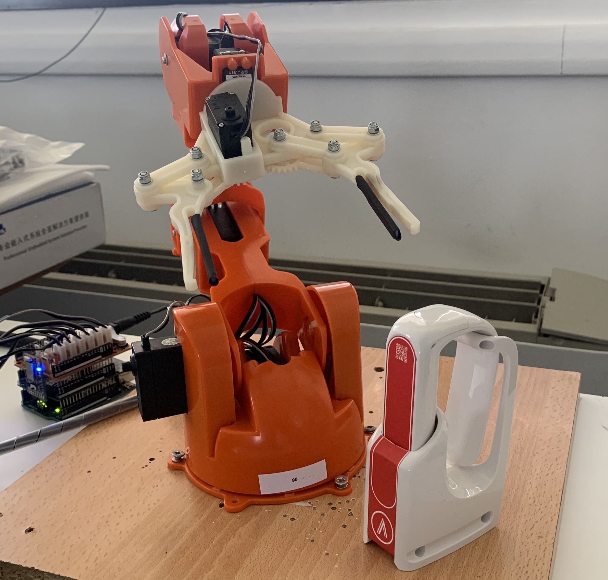

# Tactigon Braccio ROS Packages



---

This repository contains two main ROS 2 packages for controlling an Arduino Braccio robot arm, with or without a Tactigon TSkin device:

- **tactigon_ros**: Integrates a Tactigon TSkin wearable into ros, publishing a tskin custom message.
- **braccio_ros**: Provides a simplified interface to control the Braccio arm directly, without requiring a Tactigon device.

---

## Table of Contents

* [Features](#features)
* [Prerequisites](#prerequisites)
* [Installation](#installation)
* [Usage](#usage)
  * [tactigon_ros: Tactigon + Braccio Integration](#tactigon_ros-usage)
  * [braccio_ros: Standalone Braccio Control](#braccio_ros-usage)
* [System Architecture Overview](#system-architecture-overview)
* [Topics & Messages](#topics--messages)
* [Message Definitions](#message-definitions)
* [Node Details](#node-details)
  * [tactigon_ros Nodes](#tactigon_ros-nodes)
  * [braccio_ros Nodes](#braccio_ros-nodes)
* [License](#license)

---

## Features

* **tactigon_ros**: Real-time Tactigon sensor publishing, gesture-driven commands, custom ROS 2 messages.
* **braccio_ros**: Direct control of the Braccio arm from ROS 2 nodes, no Tactigon required.

---

## Prerequisites

* **Operating System**: Ubuntu 24.04
* **ROS 2 Distribution**: Jazzy Jalisco
* **Python packages**:

  ```bash
  pip install tactigon-gear tactigon-arduino-braccio
  ```
  Note: the option --break-system-packages might be needed to install the libraries globally

---

## Installation

```bash
# Clone into your ROS 2 workspace
cd ~/Tactigon-Braccio-ROS
# or your workspace root
colcon build

# Source the workspace
source install/setup.bash
```
Note: Source the workspace in every new terminal or after making a change, otherwise the message definitions and packages cannot be found.

---

## Usage

### <a name="tactigon_ros-usage"></a>tactigon_ros: Tactigon + Braccio Integration

This mode uses both the Tactigon TSkin and the Braccio arm. Use this if you want gesture-based control.

```bash
# Terminal A: Start the Tactigon data publisher
ros2 run tactigon_ros tactigon_data

# Terminal B: Start the Braccio control node 
ros2 run tactigon_ros braccio_control

# Terminal C: Start the communication between the braccio and ROS interfaces
ros2 run braccio_ros braccio_communication
```

Or launch all together: *all the nodes will be displayed in only one terminal, which makes it harder to understand.

```bash
ros2 launch tactigon_ros braccio_control.launch.py
```

### <a name="braccio_ros-usage"></a>braccio_ros: Standalone Braccio Control

This mode allows you to control the Braccio arm directly from ROS 2 nodes, without a Tactigon device. You can write your own publisher to send commands to the Braccio.

```bash
# Terminal A: Start the Braccio communication node 
ros2 run braccio_ros braccio_communication
# Terminal B: Start the Braccio_ui 
ros2 run braccio_ros braccio_ui_publisher
```

You can publish commands to the appropriate topics as documented below.

---

## System Architecture Overview

This repository implements a modular ROS 2 system for controlling an Arduino Braccio robot arm, with or without a Tactigon TSkin device. The architecture is designed for flexibility, separating gesture interpretation, command translation, and hardware execution into distinct nodes and packages.

### Node & Topic Flow

```
Tactigon Device
    │
    ▼
tactigon_ros/tactigon_data  ── publishes ──▶  /tactigon_state (TSkinState)
    │
    ▼
tactigon_ros/braccio_control ── publishes ──▶  /braccio_command (BraccioCommand)
    │
    ▼
braccio_ros/braccio_control  ── publishes ──▶  /braccio_move_result (BraccioResponse)

# For manual testing:
(braccio_ros/braccio_ui_publisher) ── publishes ──▶  /braccio_command (BraccioCommand)
```

- **tactigon_data**: Reads sensor data from the Tactigon TSkin and publishes it as TSkinState.
- **tactigon_ros/braccio_control**: Subscribes to TSkinState, interprets gestures, and publishes BraccioCommand messages.
- **braccio_ros/braccio_control**: Subscribes to BraccioCommand and controls the Braccio hardware, publishing results as BraccioResponse.
- **braccio_ui_publisher**: Allows manual publishing of BraccioCommand messages for testing and calibration.

---

## Topics & Messages

| Topic                  | Message Type      | Published By                        | Subscribed By                      | Description                         |
| ---------------------- | ---------------- | ----------------------------------- | ----------------------------------- | ----------------------------------- |
| `/tactigon_state`      | `TSkinState`     | tactigon_ros/tactigon_data          | tactigon_ros/braccio_control        | Full Tactigon device state          |
| `/braccio_command`     | `BraccioCommand` | tactigon_ros/braccio_control,<br>braccio_ros/braccio_ui_publisher | braccio_ros/braccio_control         | Command to set Braccio arm pose     |
| `/braccio_move_result` | `BraccioResponse`| braccio_ros/braccio_control         | (optional)                         | Result of each Braccio move command |

---

## Message Definitions

### TSkinState.msg (tactigon_ros)

```ros
bool     connected
float32  battery        # percentage (0–100)
uint8    selector
bool     selector_valid
Touch    touchpad
bool     touchpad_valid
Angle    angle
bool     angle_valid
Gesture  gesture
bool     gesture_valid

# Selector enum
uint8 BLE_SELECTOR_NONE=0
uint8 BLE_SELECTOR_SENSORS=1
uint8 BLE_SELECTOR_AUDIO=2
```

### BraccioCommand.msg (braccio_ros, tactigon_msgs)

```ros
int16 x           # Target X coordinate
int16 y           # Target Y coordinate
int16 z           # Target Z coordinate
string wrist_state    # "HORIZONTAL" or "VERTICAL"
string gripper_state  # "OPEN" or "CLOSE"
```
### BraccioResponse.msg (both packages)

```ros
bool     success
string   status
float32  move_time      # seconds
```

- **x, y, z**: Target Cartesian coordinates for the Braccio arm.
- **wrist_state**: Set to "HORIZONTAL" or "VERTICAL" to control wrist orientation.
- **gripper_state**: Set to "OPEN" or "CLOSE" to control the gripper.

This message is published to `/braccio_command` (by e.g. `braccio_ui_publisher`) and received by `braccio_control` for direct pose control.

---

## Node Details

### <a name="tactigon_ros-nodes"></a>tactigon_ros Nodes

#### tactigon_data

* **Executable**: `tactigon_data`
* **Publishes**: `/tactigon_state` (`TSkinState`)
* **Functionality**:
  1. Connects via Bluetooth to a Tactigon device using `tactigon_gear.TSkin`.
  2. At 50 Hz, reads battery, selector, touchpad, IMU orientation, and gestures.
  3. Publishes a `TSkinState` message.

#### braccio_control (gesture-to-command translator)

* **Executable**: `braccio_control`
* **Subscribes to**: `/tactigon_state` (`TSkinState`)
* **Publishes**: `/braccio_command` (`BraccioCommand`)
* **Functionality**:
  1. Connects to a Braccio arm via `tactigon_arduino_braccio.Braccio`.
  2. Interprets gestures and touchpad data to control the arm.
  3. Publishes move results.

### <a name="braccio_ros-nodes"></a>braccio_ros Nodes

#### braccio_control (hardware executor)

* **Executable**: `braccio_control`
* **Publishes**: `/braccio_move_result` (`BraccioResponse`)
* **Subscribes to**: `/braccio_command` (custom command message)
* **Functionality**:
  1. Connects to a Braccio arm via `tactigon_arduino_braccio.Braccio`.
  2. Accepts direct commands (e.g., from your own publisher node, CLI, or the `braccio_ui_publisher` node).
  3. Publishes move results.

#### braccio_ui_publisher

* **Executable**: `braccio_ui_publisher`
* **Publishes**: `/braccio_command` (custom command message)
* **Purpose**: 
  - Provides a simple interface to manually publish commands to the Braccio arm for testing and pose adjustment.
  - Useful for verifying Braccio movement without the Tactigon device or for manual calibration.
* **Usage Example**:

```bash
ros2 run braccio_ros braccio_ui_publisher
```

This will start the UI publisher node, allowing you to send manual commands to the Braccio arm. Make sure `braccio_control` is running to receive and execute these commands.

---

## Usage Examples

### Gesture-Based Control (Tactigon + Braccio)

```bash
# Terminal 1: Start Tactigon data publisher
ros2 run tactigon_ros tactigon_data

# Terminal 2: Start gesture-to-command translator
ros2 run tactigon_ros braccio_control

# Terminal 3: Start Braccio hardware executor
ros2 run braccio_ros braccio_control
```

Or launch the first two together:

```bash
ros2 launch tactigon_ros braccio_control.launch.py
# (then run braccio_ros/braccio_control in another terminal)
```

### Manual Braccio Control (No Tactigon Required)

```bash
# Terminal 1: Start Braccio hardware executor
ros2 run braccio_ros braccio_control

# Terminal 2: Start UI publisher for manual commands
ros2 run braccio_ros braccio_ui_publisher
```

---

## License

Made by the TactigonTeam
